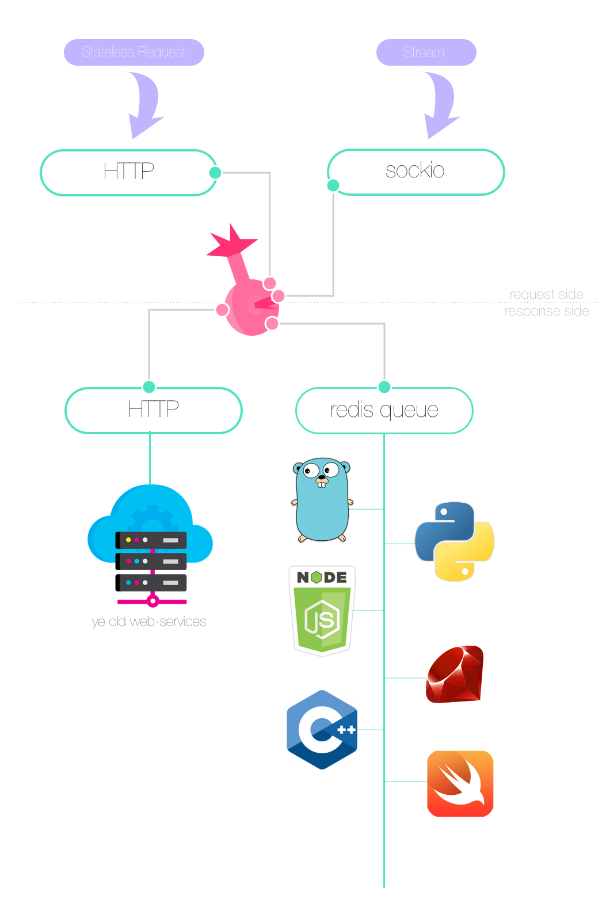

[](http://badge.fury.io/rb/plumbus)
[](https://travis-ci.org/sotownsend/plumbus)
[](https://bitdeli.com/free "Bitdeli Badge")
[](https://github.com/sotownsend/plumbus/blob/master/LICENSE)

# What is this?

Plubus is an agnostic micro-service router. 

## Features
  - [x] Bring your archaic HTTP api into the micro-service age without modifying the API
  - [x] *Any language, any networking or queuing library*
  - [x] Distributed by design, even session information
  - [x] Everything is a stream/push. Even HTTP (just a very short stream session!)
  - [x] Mix & Match - Daisy-chainable


## Example scenerio
Let's take the case where you have an aging HTTP web-service API and you want to write all future API endpoints in the 
micro-service fashion.  Additionally, you wish to add support for sockio.
<div style='text-align: center'>
  
</div>

In this example, here's our driver configuration: we're using an HTTP driver (`plumbus_http`) and a SockIO Driver (`plumbus_sockio`) on the request side.

  * *Request Side*
    * `plumbus_http_request`
    * `plumbus_sockio_request`
  * *Response Side*
    * `plumbus_http_response`
    * `plumbus_redis`

> Notice that some of the driver names include `_request` appended to them; Some drivers only support being on the *request* or *response* side. The semantics of the protocol
the driver supports generally dictate this.  For example, `plumbus_http_stateless_request` accepts incomming HTTP connections from clients. The response side of HTTP
requires that the driver *make* connections, which is a different semantic than accepting connections.  On the other hand, the `plumbus_redis` driver works on both
the request & response side because a redis queue does not differentiate between the client and server directions; both sides are able to initiate a request in the same
fashion.

## Routing schemes
Every request and response that comes through plumbus (i.e. from a request driver or back through a response driver), contains the following in [msgpack](http://msgpack.org) format:
```ruby
{
  :sid => "a1a062f25f4e94c2762886069",
  :mid => "8b43601a1a062f25f4e94c2762886069,
  :path => '/x/y/z',
  :payload => <user defined msgpack descendents>
}
```

  * `sid` - The session-identifier. Each request has a unique `sid`.  When a response driver 'replies', it sends the `sid` back to plumbus which then forwards it to the correct request driver 
  * `mid` - The message identifier. In the event a message fails to route, the message-identifier is used to signal the sender (which could be the request or response side, w.r.t to plumbus), with the mid of the failed send (signal `undeliverable`)
  * `path` - The path is used to route requests. We recommend you use unix style paths for all your requests as it makes doing things like HTTP shims easier. Else, if your HTTP requests, assuming you used a sane http request driver, would end up looking something like `myserver.io/admin_dashboard_user_new` instead of `myserver.io/admin/dashboard/user/new`.
  * `payload` - The payload is arbitrary but must be compatible with the msgpack format. This upports conversion directly to JSON under most circumstances and support for raw binary in others.

## Signals
Under certain circumstances, signals are propogated to request drivers & response-drivers. 

  * `undeliverable` - For any undeliverable message, a response-driver gets an `undeliverable` response; this may or may not be important to the driver. For example, HTTP request drivers would probably return a 404 under these circumstances.
  * `hangup` - Both a client request and all associated responses are able to hang-up (or not, for stream based responses). In the event a response hangs-up, if there are no remaining responsees, the client will not receive a hangup signal. In the event the request hangs-up, all responses associated with the original request (that have not themselves hung-up) will receive the `hangup` signal. For drivers like a typical HTTP request driver, this can utilized to determine that the HTTP request has received all the information and it should finish sending the client the HTTP stream and close the connection. For stream-based drivers, this provieds a useful way to `watch` resources or enable `push` notifications.
  * `panic` - In the event a bonified un-recoverabl exception occurrs, and not user-based exceptions like authorization failures, missing parameters, etc, a response may reply with `panic`. Typically, a `panic` would be followed by a `hangup`. Sane HTTP request drivers may use this to return a `500` type excption.

## Streaming
All connections in plumbus are streams. HTTP, as it is stateless, is just treated as a degenerate stream that closes it's session after a response is given. One of the neat-things
about plumbus is that streams are able to hit multiple responses (by virtue of a request stream has sent multiple action requests and those were routed to seperate responses). This
provides you with load-balancing on traditionally single-server streams (like sock.io).

## Configuration
Configure is handled through a ruby file. This file contains a listing of `ports` which are just driver instances that are declared on either the request or response side.
```ruby
port(:request, 'plumbus-http') do
  #Driver specific config
end

port(:request, 'plumbus-sockio') do
  #Driver specific config
end

port(:response, 'plumbus-http') do
  #Driver specific config
end

port(:response, 'plumbus-redis-queue') do
  #Driver specific config
end
```

# Setup
```js
#Setup
gem install plumbus
```

# Usage
#### SYNOPSIS
```js
plumbus config
```
#### DESCRIPTION
config is a ruby file that declares backends & frontends (called ports).

## Requirements

- Modern **nix** (FreeBSD, Mac, or Linux)
- Ruby 2.2.1 or Higher (Very important)

## Communication
> ♥ This project is intended to be a safe, welcoming space for collaboration, and contributors are expected to adhere to the [Contributor Covenant](http://contributor-covenant.org) code of conduct.

- If you **found a bug**, open an issue.
- If you **have a feature request**, open an issue.
- If you **want to contribute**, submit a pull request.

## Installation

RVM users:
Run `gem install plumbus`

System ruby installation?
Run `sudo gem install plumbus`

---

## FAQ

### When should I use plumbus?

Todo

### Creator

- [Seo Townsend](http://github.com/sotownsend) ([@seotownsend](https://twitter.com/seotownsend))


## License

plumbus is released under the MIT license. See LICENSE for details.
